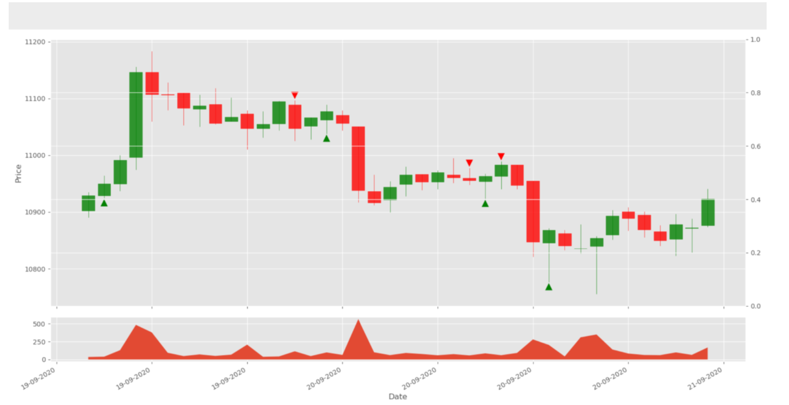
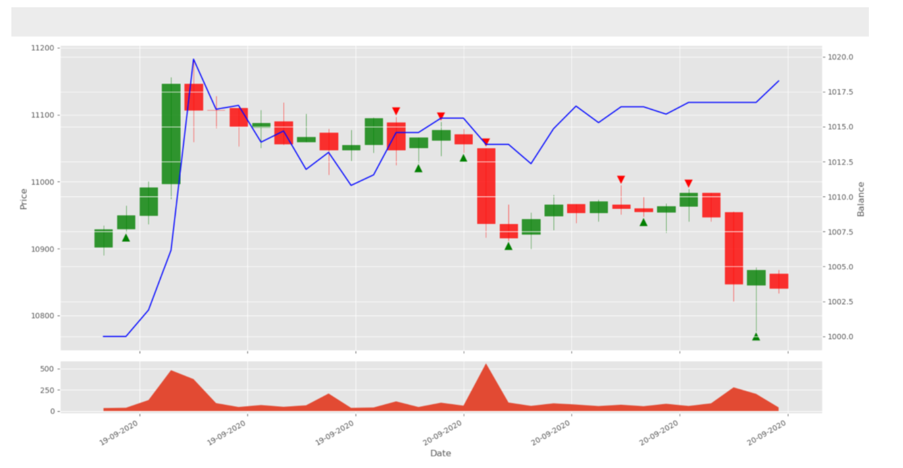
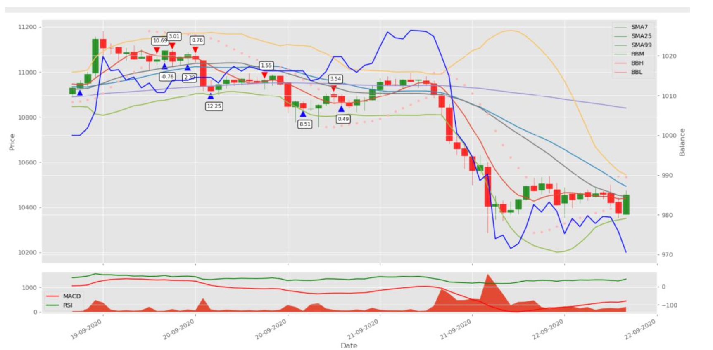

# Reinforcement Learning

This project focuses on applying reinforcement learning techniques to trading using the OHLCV data from the Binance API. We stream live data to our Actor-Critic model, collecting data every minute. The OHLCV data is represented as `float64` values, and the date is stored as an object type.

## Model Architecture

Our Actor-Critic model is developed using the TensorFlow API, incorporating CNN, LSTM, and Dense layers. The model makes use of various indicators and historical data to inform its decision-making process. The action states for our agent are Buy, Sell, and Hold, and the reward algorithm is based on TD (temporal difference) learning.

## Environment and Interactions

We created an environment that takes into account past interactions to make decisions. The environment considers variables such as order history and market history. The agent interacts with the environment by analyzing previous OHLCV data and evaluating wallet conditions such as balance, available funds for buying coins, net worth, and the value of balance and current coins.

## Reward Calculation

The environment calculates the reward for the agent based on the total number of coins and the price at which they were bought, considering their current value. We employ typical indicators such as simple moving average, Bollinger Bands, Parabolic Stop and Reverse, MACD, and RSI. We incrementally introduce these indicators and measure the improvement in the agent's performance.

## Examples

Below are some examples that demonstrate the agent's behavior using different indicators:

- Candlestick chart with BUY (GREEN) / SELL (RED) signals without reward policy.

- Candlestick chart with BUY (GREEN) / SELL (RED) signals and the WALLET BALANCE of the agent (BLUE).

- Candlestick chart with BUY (GREEN) / SELL (RED) signals, WALLET BALANCE of the agent (BLUE), Technical Indicators, and Agent Reward (in boxes).

